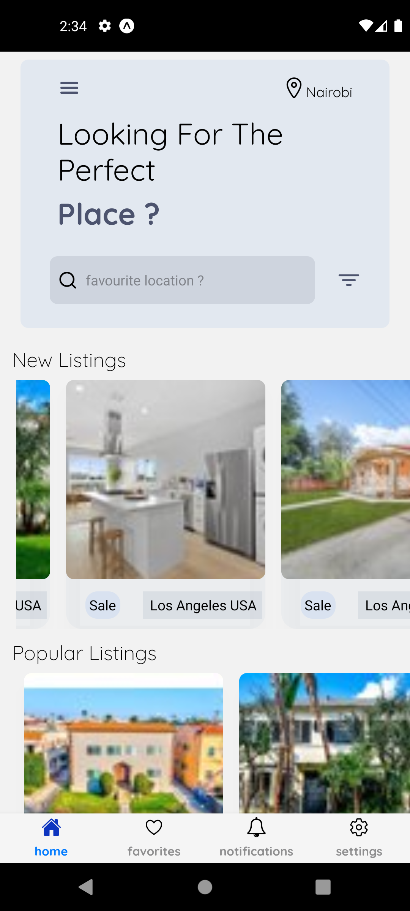

**RENTY APP** 📱

 This React Native app, built using Expo and Native Wind, helps you explore available properties with ease. Here's a brief overview of its features:

Explore Units: Browse through a variety of properties for sale.
Location-based Search: Find units based on specific locations.
Detailed Unit View: View comprehensive details and multiple photos for each unit.
Favorites: Save units for future reference and easily access them later.

More features to be added on future iterations of the app

**Screenshots**

Please Note that the low quality images are due to the API and not an app bug

 

